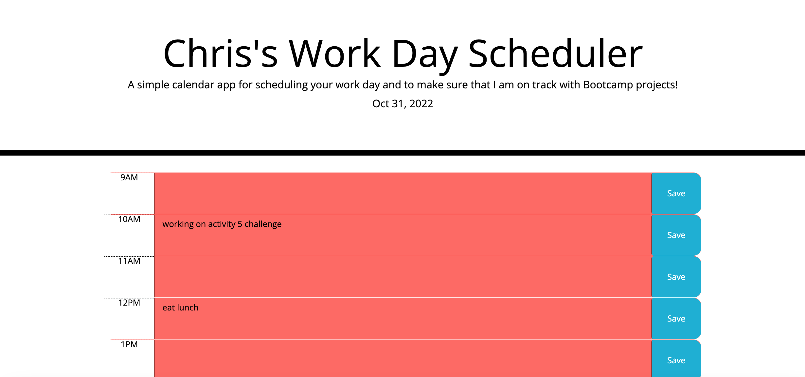
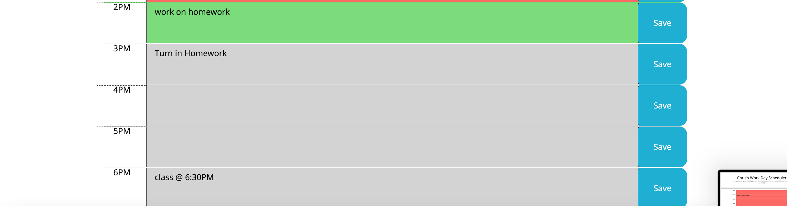

## H2 Challenge

# Description

In this project, we were tasked with creating refactoring a work schedule that changes the date daily, you are able to type and save your daily schedule, will be able to save
to the local storage within Chrome and various platforms, and then will have the ability to refresh or come back to the webpage and the information stored will still be there.

# Installation

N/a

# Usage

To use this project, you will be able to open up the live URL in Chrome through the DevTools by pressing Command+Option+I on mac OS. A console panel should open either below or to the side of the webpage in the browser.

# Credits

I credit Chad and Nick and the rest of the UCI Bootcamp for teaching me the tools to complete this task and then a UCI tutor to help me out with some functions and refactoring.

# License

N/a

# Features

N/a

# How to Contribute

N/a

# Tests 

N/a

# Mock-UP

Please refer to the follow images for a mockup of my results:

# Website Link
